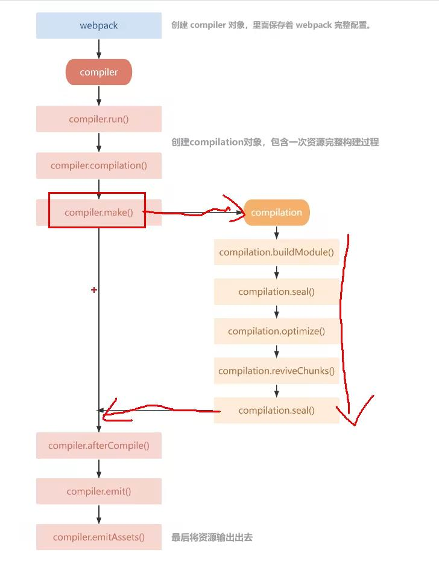

# Plugin 的作用
    通过插件我们可以扩展 webpack ，加入自定义的构建行为，使 webpack 能够执行更广泛的任务，拥有更强的构建能力

# Plugin 工作原理
在 webpack 特定的钩子上做自己的事。webpack 在编译过程中，会触发一系列的 Tapable  钩子事件。

# webpack 的钩子
    钩子的本质就是 “ 事件 ”
## Tapable
tapable 为 webpack 提供了统一的插件接口（钩子）类型定义，它是 webpack 的核心功能库。webpack 中目前有 <b>10</b> 种 hooks。

tapable 还统一暴露的三个方法给插件，用于注入不同的自定义构建行为。

- tab：可以注册同步钩子和异步钩子。
- tabAsync：回调方式注册异步钩子。
- tapPromise ：Promise 方式注册异步钩子。

# Plugin 构建对象

## compiler
    compiler 对象中保存着完整的 webpack 环境配置。每次启动 webpack 构建时它都是一个独一无二，仅仅会创建一次的对象。

    这个对象会在首次启动 webpack 构建时创建，我们可以通过 compiler 访问到如 loader、plugin 的配置信息。

它有一下主要属性：
- compiler.options 可以访问本次启动 webpack 时所有的配置文件，包括但不限于 loaders、ertry、output、plugin 等完整配置信息。

- compiler.inputFileSystem 和 compliler.outputFileSystem 可以进行文件操作，相当于 node 中的 fs。
- compiler.hooks 可以注册 Tapable 的不同种类 Hook，从而可以在 compiler 生命周期中植入不同的逻辑。

### compiler 钩子：
- entryOption
- afterPlugins
- beforeRun
- run
- watchRun
- make
- compile
- emit
- done

## Compilation
Compilation 对象代表一次资源的构建，compilation 实例能够访问所有的模块和它们的依赖。
一个 Compilation 对象会对构建依赖图中所有模块进行编译。在编译阶段，模块会被加载(load)、封存(seal)、优化(optimize)、分块(chunk)、哈希(hash)和重新构建(restore)。

它有以下主要属性:

- compilation.modules 可以访问所有模块，打包的每一个文件都是一个模块。

- font color="orange">compilation.chunks chunk 即是多个 modules 组成而来的一个代码块。入口文件引入的资源组成一个 chunk，通过代码分割的模块又是另外的 chunk。
- font color="orange">compilation.assets 可以访问本次打包生成所有文件的结果。
- font color="orange">compilation.hooks 可以注册 tapable 的不同种类 Hook，用于在   Compilation 编译模块阶段进行逻辑添加以及修改。

### Compilation 钩子
- afterHash
- beforeHash
- optimize
- recordModules

# Plugin 创建流程

